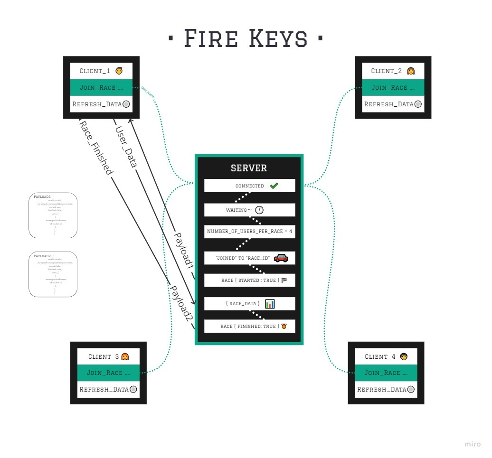

# Fire Keys

The Fire Keys web App: an online typing competition, allows users to race each-other by typing different quotes.And also allow users to view the active races.

 
 Fire Keys app built with `node.js` and `soket.io`

## Authors
* [Wesam Almasri](https://github.com/WesamAlmasri)    
* [Furat Malkawi ](https://github.com/furatmalkawi29)   
*  [Nour Abu Elenein](https://github.com/engnour94)  
*    [Wafa'a Ankoush](https://github.com/wafaankoush99)  
*   [As-har Abuhelweh](https://github.com/asharabuhelweh)

## Links
* [GitHub Repository](https://github.com/fire-keys/firekeys)
* [Heroku Deployment](https://fire-keys.herokuapp.com/)

## The Features of the Fire Keys web app
1. Create new race room.
2. Multiple user can join the race using username. 
3. Wait to complete the minimum numbers of users to start the race. 
4. Starting the race and account the WPM and the progress for each user.
5. Finish rhe race when the progress of a user reach 100% or when disconnect all users except one.
6. Create a new race room when the users numbers is more than allowed users per room.
7. The user can view all the active races.   

## Setup 
*  clone the repository from the GitHub 
 
     `git clone https://github.com/fire-keys/firekeys.git`
  *  ``npm i``

## Run the app
`npm start`

## UML Diagram

